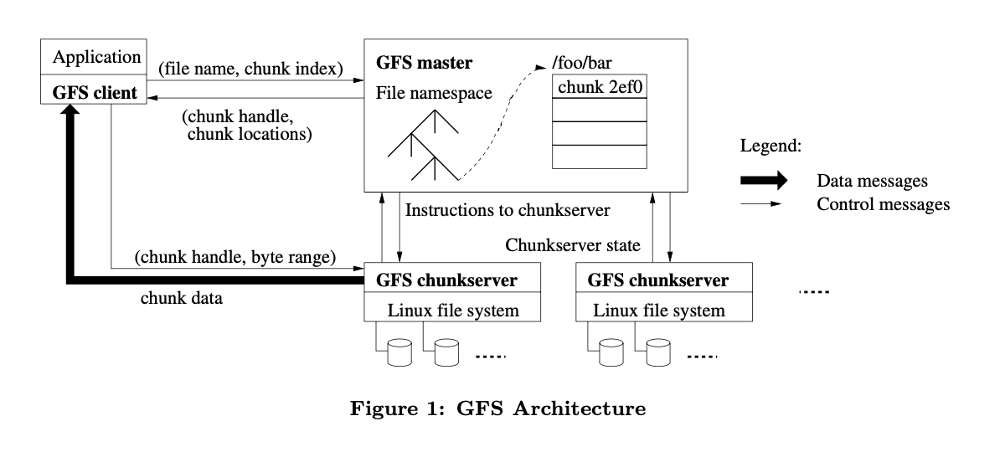
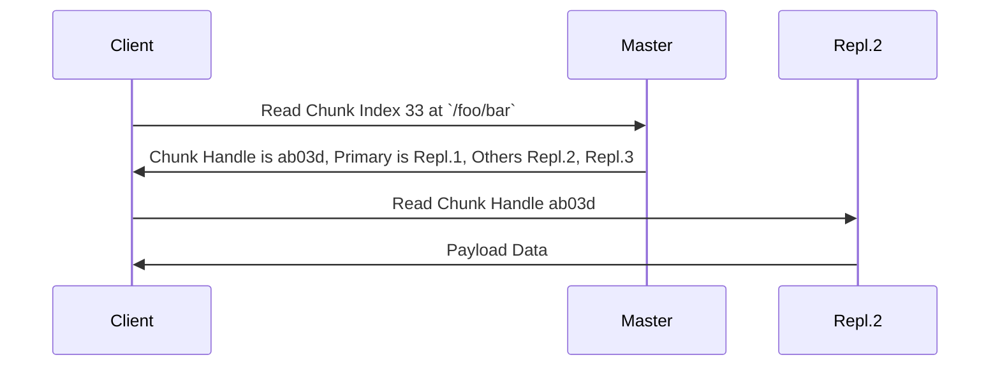

## 背景

GFS 的研发主要在 2003 年左右，那个时候 Google 的搜索业务已经基本成形，其主要依赖爬虫来定期的抓取互联网上的各种网页，为他们建立索引来帮助人们可以通过简单的关键词快速找到他们。对于互联网上的网页进行抓取、处理和索引对于存储是一个巨大的挑战，Google 需要一个存储服务来承担这项任务。

那时候的 Google 自然可以选择将这个需求外包给 IBM 这种 2B 的企业，但是毫无疑问，这会给他们带来巨额的开销。其实更形式化的来说，这涉及系统层面的 Scale Up 和 Scale Out 两个问题。即当我们的系统无法承载当前业务的需求时，我们需要 Scale 这个系统的负载，这个时候存在两个方向

- Scale Up：增加系统中每个节点的能力，来增加整体的负载
- Scale Out：增加系统中节点的数量，来增加整体的负载

这就好比对于一个军队来说，你想要增加整体的战斗力，你要么 Scale Up，即增加每个士兵的能力，或者 Scale Out，增加士兵的数量。在实践中我们往往可以发现，计算机系统的 Scale Up 的成本往往高于 Scale Out，你把一个 CPU 的主频从 3 GHz 提升到 6 GHz 的成本远高于购买两个 3 GHz 的 CPU 拼到一块。但是并不是所有的系统都有 Scale Out 的能力，设计一个容易 Scale Out 的系统需要我们付出更多的努力。

所以，Google 的选择是 Scale Out，设计出一个运行在消费级电脑组成的集群上可以稳定运行的、高吞吐的分布式文件系统。按照 Paper 中的描述，其当时最大的集群由 1000 个节点组成，提供了总共约 300 TB 的存储空间。

## 设计

GFS 的整体架构如上图所示，Client 部分需要链接一个库来和集群沟通，在 Server 部分包括一个 Master 和若干个 Chunk Server。GFS 作为一个文件系统，其 API 与 POSIX 标准相类似，是一个简化过后的版本。我们可以使用 `/foo/bar/a.txt` 这样的路径来访问一个文件，与 Unix 里常见的路径表示基本一致，我们把这个结构称为 File Namespace。

Master 作为整个 GFS 的中心，仅维护整个系统的 Metadata，而具体文件的数据分布在具体的 Chunk Server 里。对于存储在 GFS 当中的任何一个文件，都按照 64 MB 为单位分割成了若干个连续的 Chunk，同时每个 Chunk 分布在三个位于不同机架上的 Chunk Server 里。这里需要注意的是，GFS 虽然整体的设计是分布式的，但是其还是假设了各个节点之间的高速的网络连接，因此一个 GFS 集群总是部署在一个机房里的，因此如果这个机房发生了停电或者产生了地震之类的灾害，那么整个集群还是会不可避免的崩溃。在一个机房内，可能会出现的一个问题是一个机架发生了倒塌或者电源线被人碰掉，导致整个机架的节点下线，这个时候如果我们的 Chunk 都处在一个机架的 Chunk Server 上，还是会发生数据的丢失，因此我们需要将 Chunk 分布在不同的 Chunk Server 上。同时，这样做还有一个好处是可以增加读的带宽，可以增加对网络拓扑结构的利用率；但是这样的代价是写的时候也需要占用更多的带宽，这是他们在设计时做出的一个 Design Decision。

Master 上不仅存储了整个文件系统的 File Namespace，还存储了 File Path 到 Chunk Handle 的映射，以及每个 Chunk 都存储在哪些 Chunk Server 中。其中 File Namespace 和 File Path 到 Chunk Handle 的映射都是持久化到磁盘上的，但是 Chunk Location 并不持久化。Master 会定期的向每个 Chunk Server 发送 Heartbeat Message 来同步 Chunk Location，但是并不写入磁盘，因为这些信息本身就是由 Chunk Server 同步的，如果我们连向 Chunk Server 请求这些 Metadata 都做不到，就没有理由认为他可以为 Client 提供服务。与之相对的，File Namespace 和 Chunk Handle 的映射是由 Master 唯一指定的，因此这些信息也只能持久化到 Master 上。

### Master & Primary

对于整个 GFS 的协调，我们交由 Master 来负责，但是为了保证 High Availability，我们需要保证每个 Chunk 有 3 个 Replication，这里就涉及到这三个 Replication 之间 Consistency 的问题。考虑当多个客户端需要并发的写某个 Chunk 时，我们需要保证最后在三个 Replication 的结果是一致的，同时我们希望尽可能的减少 Master 的负担，因此希望这个 Consistency 可以由三个 Replication 本身来保证，因此我们需要 Master 在这三个 Replication 之间指定一个 Primary，由他来确定整个 Mutation 的顺序。

这里引出的另一个问题就是，这三个 Replication 本身作为一个分布式的系统，需要就谁是 Primary 这个事情达成一致，即我们不希望有两个 Replication 同时认为自己是 Primary 来接收客户端的请求。这里是由 Master 来发放 Lease 来保证的，即 Master 通过某种方式来确定出三个 Replication 中某一个是 Primary，然后通知这三个 Replication 其中一个 Replication 在未来的 60 秒之内是 Primary。那么如果不出意外，在未来的一段时间内 Master 可以和 Primary 通过 Heartbeat 保持沟通，那么 Master 就会延长这段时间；如果失去了联系，即发生了 Network Partition，那么 Master 就会等到 Lease 过期后重新指定一个新的 Primary，而老的 Primary 在 Lease 过期后没有获得 Master 的续约，就会认为自己不再是 Primary，从而拒绝客户端的请求。可以看出，GFS 通过接受一定时间的不可用来保证了 Replication 之间就 Primary 的 Consistency。

### R & W

